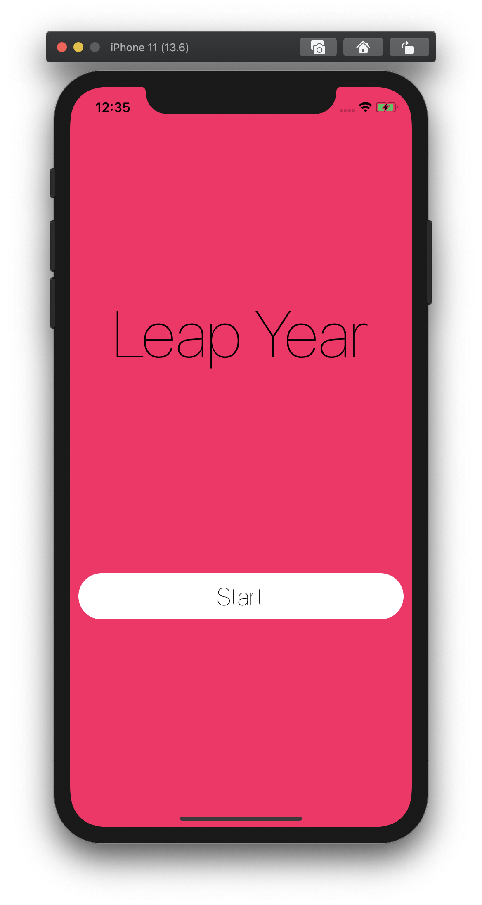

<h1 align="center">
  LeapYear App
</h1>

Tiny React Native App which displays whether the current year is a LeapYear (developed with a test-driven-development approach)

### Welcome Screen

    
    

